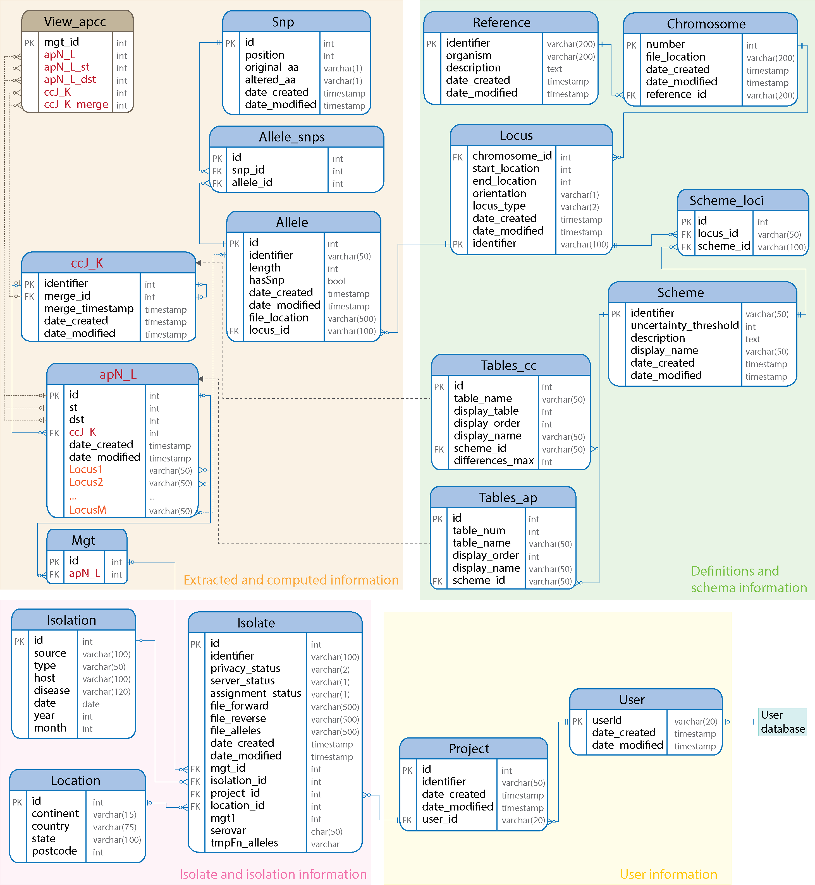

.. _database_schema:

***********************************
Database schema
***********************************

Data for each organism is stored in its own postgres database. The schema is as follows:

The number of schemes (or levels) defined for the organism are stored in the ``Scheme`` table. Allelic profiles for each MGT level are stored in separate tables indicated by ``apN_L``. Clonal complexes for each MGT level, and at each level of threshold are stored in separate tables as well, indicated by ``ccJ_K``. 

User information is stored in a separate database (schema not shown here).

