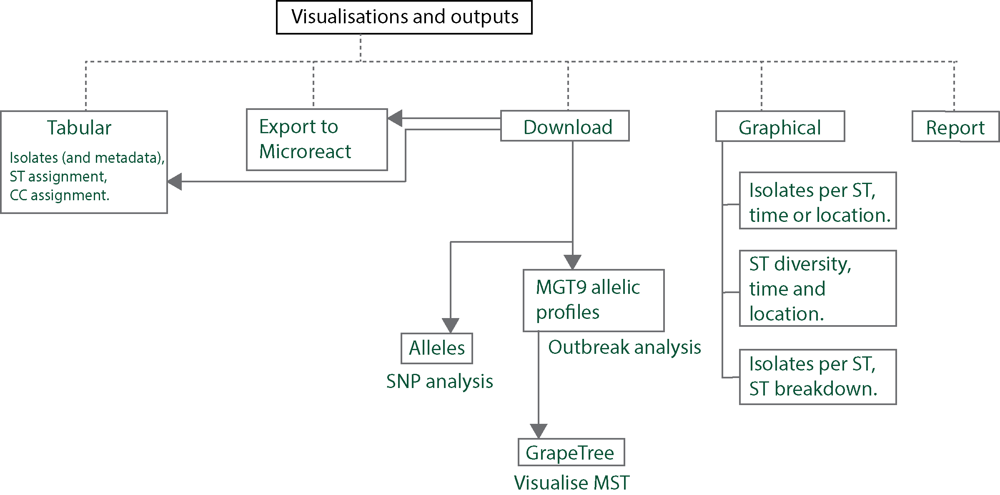
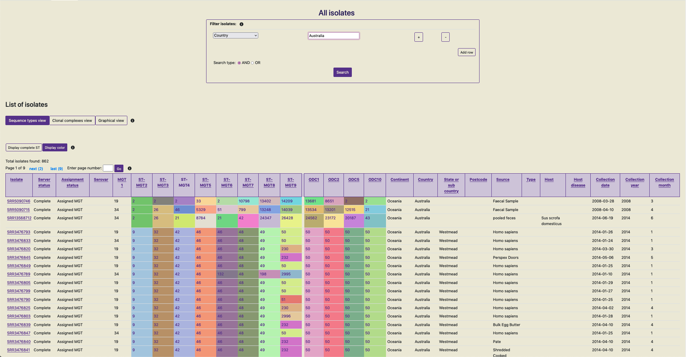
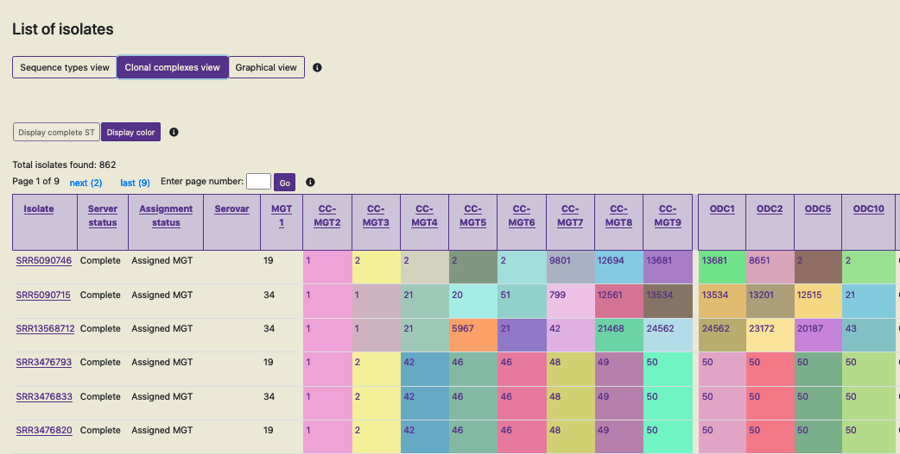

.. _downloads: 

***********************************************
Data visualisation, download and export
***********************************************

MGTdb enables a number of different visualisations and downloads.

===========================
Tabular
===========================
All initially-loaded, or filtered- isolates are shown in a table as below. 

Data shown in screenshot: https://mgtdb.unsw.edu.au/salmonella/isolate-list?country=Australia&searchType=and

Key features of the table are: 

* The table shows 100 isolates at one time.
* All initially-loaded or filtered isolates can be sorted by clicking on a cell in the table header. By default, rows without any values (i.e. null values) are added to the end in the sorted result. 
*  The table shows the isolates and their metadata. By default the table shows STs assigned to the isolate at every MGT level, and ODCs. 
*  The user can switch this view by clicking on the button 'Clonal complexes view' - this updates the table to show CCs at all MGT levels in place of STs. 

*  The cells containing the ST, CC and ODC values are coloured according to the identifier - this can enable recognizing identical values across the table easily. This feature can be switched off by clicking on 'Display color' when required.
*  dST.

===========================
Interactive graphics
===========================

===========================
Report
===========================

===========================
Downloads
===========================

ST, CC and ODC assignments 
-------------------------------

Allelic profiles
-------------------------------

Alleles
-------------------------------

===========================
Microreact
===========================

===========================
Grapetree
===========================
1. Export data 
---------------

2. Import in grapetree 
-----------------------

1. Download MGT9_allelic profiles (for MST)

a. Add '#' in line 1. 

b. Replace ',' with '\t'. 

c. Import as profile into graphtree & and run MST_v2 algorithm. 

2. Download MGT table (for metadata) 

a. Replace column name 'Isolate' to 'ID'. 

b. Import as metdata into graphtree. 