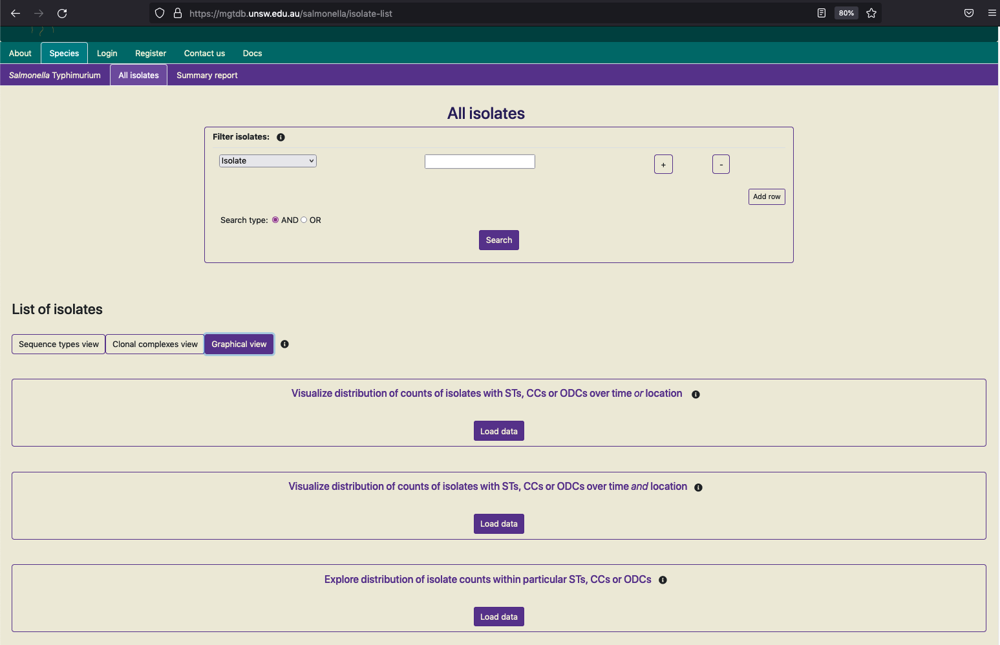

.. _downloads: 

***********************************************
Data visualisation, download and export
***********************************************

MGTdb enables a number of different visualisations and downloads.

===========================
Tabular
===========================
All initially-loaded, or filtered- isolates are shown in a table as below. 

.. image:: images/tabular.png
  :width: 2000
  :alt: Table showing all initially-loaded or filtered isolates

Data shown in screenshot: https://mgtdb.unsw.edu.au/salmonella/isolate-list?country=Australia&searchType=and

Key features of the table are: 

* The table shows 100 isolates at one time.
* All initially-loaded or filtered isolates can be sorted by clicking on a cell in the table header. By default, rows without any values (i.e. null values) are added to the end in the sorted result. 
*  The table shows the isolates and their metadata. By default the table shows STs assigned to the isolate at every MGT level, and ODCs. 
*  The user can switch this view by clicking on the button 'Clonal complexes view' - this updates the table to show CCs at all MGT levels in place of STs. 

.. image:: images/tabular_btnsSTsCCs.png
  :width: 800
  :alt: Table showing all initially-loaded or filtered isolates

*  The cells containing the ST, CC and ODC values are coloured according to the identifier - this can enable recognizing identical values across the table easily. This feature can be switched off by clicking on 'Display color' when required.
*  dST.

===========================
Interactive graphics
===========================
All isolates in the database, or filtered isolates can be graphically summarized. Clicking on 'Graphical view' loads a page which can summarise the data in three ways: 

1. Distribution of counts of isolates with STs, CCs or ODCs over time or location
2. Distribution of counts of isolates with STs, CCs or ODCs over time and location
3. Distribution of isolate counts within particular STs, CCs or ODCs

The first two utilize temporal and spacial metadata associated with isolates. The third does not utilize such metadata, but only utilizes the associated MGT assignments (STs, CCs and ODCs). 

To visualise any of these graphs, the data needs to be initially loaded by clicking on 'Load data'. The data is fetched, transformed and plotted (the first graphical view is shown below for all public data in the *Salmonella* Typhimurium database).  

Key features of these graphs are as follows: 

* Same colored bars indicate the same ST (or CC, ODC) value. 
* Hovering over the bar reveals the ST (or CC, ODC) value. 
* The buttons at the top of the graph enable the graph to be interactively explored. This re-transforms and re-plots the data.
* As not all isolates, for which the plot has been generated, will contain metadata annotations; the counts of those that do contain the required metadata and are included in the plot are indicated below. 
* The displayed graph can be downloaded by clicking on the link 'Download SVG' below the plot. On most browsers, simply clicking on the link can download the SVG, however, on some browsers, right-clicking on the link triggers the download. 

**Note:** It is strongly recommended that these graphs be used with data filtered to a smaller set (compared to the complete data in the databased). Otherwise, depending on your browser and computer, this process may take a long time, as the data for plotting is loaded via javascript onto the users browsers, and rendering a plot with tens-of-thousands of bars may be computationally intensive. 

===========================
Report
===========================

A report can be generated on MGTdb for any given country (or project - if logged in). The report summarizes data at every MGT-level in the past 10 years. 

For every organism, the 'Summary report' button in the header navigates to a page, where the user can select any country (or project) and generate the report. 

Once the 'Generate report' button is clicked, MGTdb retrieves isolates with the requested metadata from the database, and generates the charts. The report depicts static charts - where the first four charts summarize data for all MGT levels in general, followed by six charts summarising the data at each MGT level. The figure below shows the first chart from the report. 

.. image:: images/report_chart_1.png
  :width: 2000
  :alt: Report chart 1

By scrolling all the way to the bottom of the report, users can find a button to download the report as an HTML document. 

.. image:: images/report_download_btn.png
  :width: 400
  :alt: Button to download the report

===========================
Downloads
===========================

Filtered data (or all initially-loaded data; albiet with row limits) can be downloaded using buttons available below the table (see `Tabular`_ for details of the table).

Download the entire set as CSV
------------------------------------

The set of searched (or initially loaded) isolates, along with the associated metadata, ST, CC and ODC assignments (i.e the data shown in the table, in both the ST and CC views) can be downloaded as a CSV file. Currently, a maximum of 1000000 isolates can be downloaded in one go. The larger the number of isolates requested for download, depending on your internet speed, this process may take a few minutes.

Download MGT9 allelic profiles
-------------------------------------

The set of searched (or initially loaded) isolates, along with the highest level MGT allelic profiles can be downloaded in CSV format. Currently, allelic profiles for maximum of 10000 (the first 10000) isolates are downloaded via one request.

When the "In GrapeTree format" option is selected, the ST and dST columns are removed, and the negative alleles (i.e. alleles with missing information) are converted to positive alleles. This allows using the downloaded CSV file as input to the `GrapeTree <https://github.com/achtman-lab/GrapeTree>`_ tool (the STs, dSTs and other information downloaded from "Download the entire set as CSV" can be used as metadata in GrapeTree). Thus, by visualising the downloaded files in, the epidemological investigations revealed through the minimal spanning tree built using allelic profiles of the downloaded isolates can be conducted. 

A few minor modifications are required to the files to be used by GrapeTree: 

1. For the allelic profiles file: 

a. Add '#' at the start of line 1. 
b. Replace commas (','') with tabs ('\\t') - a find and replace-all will work. 
c. Import as *profile* into `GrapeTree <https://github.com/achtman-lab/GrapeTree>`_ and run the MST_v2 algorithm. 

2. For the file downloaded via the button 'Download the entire set as CSV' - this can serve as the metadata file in GrapeTree: 

a. Replace column name 'Isolate' to 'ID'. 
b. Import as *metadata* into graphtree. 

In the future we plan to make these modifications directly in MGTdb. 

View in Microreact
--------------------

The set of searched (or initially loaded) isolates, along with the associated metadata, ST, CC and ODC assignments can be downloaded as a CSV in Microreact format. `Microreact <https://microreact.org/showcase>`_ is a powerful tool, that allows exploring the epidemeology of the searched (or loaded) isolates in a map-based context.

.. image:: images/microreact_btnAsLink.png
  :width: 2000
  :alt: Clicking on 'View in Microreact'

The isolates are sent by MGTdb to Microreact via Microreact's API and the link returned by Microreact is displayed instead of the button (as shown in the screenshot above). This link opens data in Microreact in a new tab (as shown in the screenshot below). Current, there a limit of 2000 isolates per request (limit set by Microreact). 

Allelic profiles and alleles for all public isolates
------------------------------------------------------
Allelic profiles and allele sequences for all public available isolates can be downloaded from the organism home page (seen as blue links in the figure below). These files are currently uploaded daily. 

1. The *allelic profile* assignments compressed file lists all the publicly available isolates and their MGT9 allelic profile assignments, in a tabular format.
2. The *allele* sequences is a compressed folder containtaining files of allele sequences of every locus that forms part of any MGT schema.

