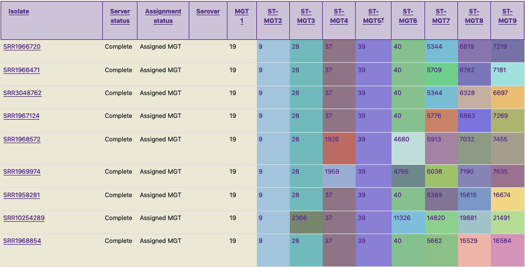
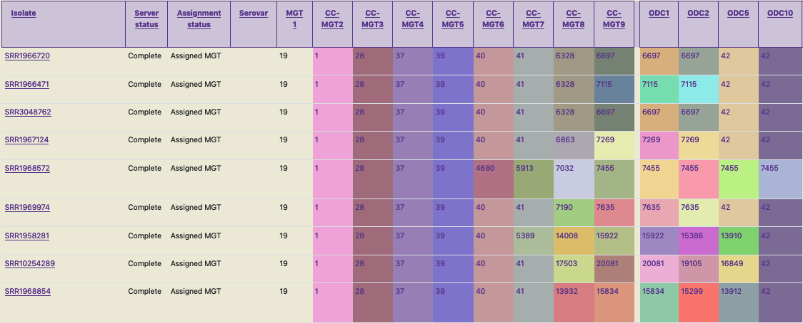

.. _overview:

***********************************
MGT overview
***********************************

MGT stands for multilevel genome typing, a novel technique to stably characterize bacteria (Payne *et al.* 2020). MGT is based on multilocus sequence typing (MLST). MGT provides multiple MLST-like schemes within the one system - thus enabling the study of isolates at multiple levels of relatedness (such as closely related or distantly related) using the one approach. 

Each isolate is assigned a sequence type (ST) at each of the MGT-levels, and the assigned ST at each level is the isolate's genome type (GT). For example, an isolate SRR1966720 (as shown in the table in the screenshot below), is assigned an ST at each MGT level such as: 19-9-28-37-39-40-5344-6819-7219 - this is the GT of this isolate (similar to a barcode).

The identifier is assigned based on variations in certain grouped sets of genes (9 in this case, MGT1 to MGT9, hence the 9 numbers in the identifier). The groups are defined based on mutational rates, where the earlier (/smaller) groups depict slower mutational rate changes compared to the later (/larger) ones. For *Salmonella enterica* serovar Typhimurium, the groups (or MGT levels) MGT1 to MGT7 consist of a mutually exclusive set of loci, where as MGT8 and MGT9 include MGT1 to MGT7. This is also the case for other organisms hosted on MGTdb, where the lower levels consist of a mutually exclusive loci set, and the higher levels include the lower levels. 

A MGT barcode assigned to a bacterial genome is stable and can be used to uniquely and consistently identify strains with a particular genome type. Isolates which are similar can be identified by the same ST-values at the MGT levels. **The same STs have the same colours in the table (thus enabling easy visual identification).** 

Occasionally, due to the mutually exclusive nature of the lower MGT levels, a user may encounter *hierarchical inconsistencies* - i.e. a scenario where mutation in a lower resolution level (e.g. MGT3) could result in two separate STs, while a higher resolution level (e.g. MGT4) has one. This is exemplified in the ST assignments for the last three isolates in the first screenshot below. Here, the isolate SRR10254289 consists of MGT3 ST2366, whereas isolates SRR1958281 and SRR1968854 consist of MGT3 ST28. But there is no such inconsistency at MGT1 and MGT3 levels, where all three isolates are assigned the same ST. Thus, this hierarchical inconsistency can be resolved by interrogating levels above and below the inconsistent one, allowing the true relationship between isolates to be described.

Additionally, to identify strains which are closely related, clonal clusters (CCs) or outbreak detection clusters (ODCs) can be used. In this clustering approach, STs which have atmost one allele difference for CCs, from any other STs are grouped together. ODCs are similar to CCs, however, here the maximum number of allele differences are indicated by the number following the ODC. E.g. ODC10 allows a maximum of 10 allele differences. Again, the use of CCs or ODCs can also help identify strains which are closely related at a particular level (as an alternative to interrogating the higher or lower MGT STs). For example, the three isolates mentioned in the paragraph above are all assigned the same MGT3 CC (of 28), indicating that these isolates are closely related. However, the use of CCs or ODCs for nomenclature should be avoided, as this nomenclature is not stable - the use of STs on the other hand is stable. So, to assign a stable nomenclature to the above mentioned three strains a possibility is: GT19-9-X-37-39.   

This screenshot of MGTdb shows GTs of a few *Salmonella* Typhimurium isolates. 

In this screenshot, the same strains as in the previous figure are shown, but instead of the stable MGT STs, shown are an unstable CCs at each MGT level, and ODCs which are calculated for the largest MGT level. CCs and ODCs enable further relatedness analysis.  

References
----------

Payne M, Kaur S, Wang Q, Hennessy D, Luo L, Octavia S, Tanaka MM, Sintchenko V, Lan R. Multilevel genome typing: genomics-guided scalable resolution typing of microbial pathogens. *Eurosurveillance*. 2020 May 21;25(20):1900519.

