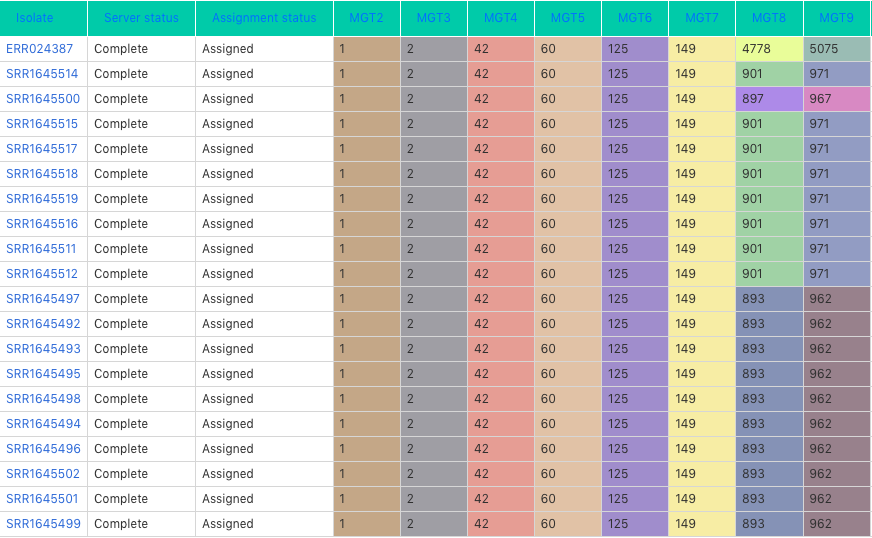

.. _overview:

***********************************
The MGT overview
***********************************

MGT stands for Multilevel Genome Typing. The aim of this resource is to provide a standardised naming system for various bacterial species.

Each isolate is assigned a standardised identifier, similar to a barcode, e.g. an isolate L842_S20_L001 has a MGT identifier: 9-47-56-66-544-715-875-942.

The identifier is assigned based on  variations in certain grouped sets of genes. The groups are defined based mutational rates, where the earlier (/smaller) groups depict slower mutational rate changes compared to the later (/larger) ones.

The MGT identifier is stable and can be used to uniquely and consistently identify strains with a particular genome type. To identify strains which are closely related, clonal clusters are used. In this grouping scheme, MGT identifiers which have at-the-most one difference from any other MGT identifier in the group. So for the isolate L842_S20_L001, the isolates similar to it are shown in the figure below:

The table

