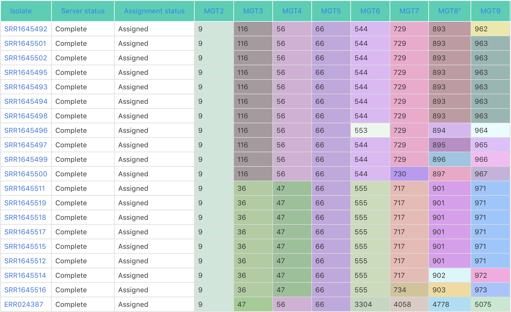

.. _overview:

***********************************
The MGT overview
***********************************

MGT stands for Multilevel Genome Typing. The aim of this resource is to provide a standardised naming system for various bacterial species.

Each isolate is assigned a standardised identifier, similar to a barcode, e.g. an isolate L842_S20_L001 has a MGT identifier: 9-47-56-66-544-715-875-942.

The identifier is assigned based on  variations in certain grouped sets of genes (8 in this case, MGT2 to MGT8, hence the 8 numbers in the identifier). The groups are defined based on mutational rates, where the earlier (/smaller) groups depict slower mutational rate changes compared to the later (/larger) ones.

A MGT barcode assigned to a bacterial genome is stable and can be used to uniquely and consistently identify strains with a particular genome type. To identify strains which are closely related, clonal clusters are used. In this grouping scheme, MGT identifiers which have at-the-most one difference from any other MGT identifier in the group. So for the isolate L842_S20_L001, the isolates similar to it are shown in following two figures below:

In this figure, strains similar to L842_S20_L001 are shown along with their MGT identifiers.

.. image:: images/ccs.png
  :width: 800

In this figure, the same strains as in the previous figure are shown, but instead of the stable MGT identifier, shown are an unstable clonal cluster number at each MGT level. Here, the strains in the same clonal cluster, MGT7-CC-149 are shown. 
