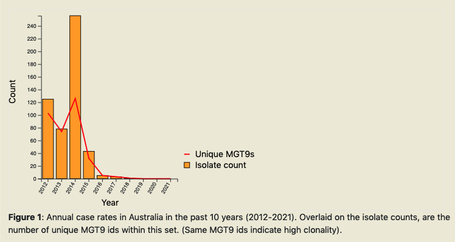

.. _report:

**********************************************
Summary report
**********************************************

A report can be generated on MGTdb for any given country (or project - if logged in). The report summarizes data at every MGT-level in the past 10 years. 

.. image:: images/report_access.png
  :width: 2000
  :alt: Generating a report on MGTdb

For every organism, the 'Summary report' button in the header navigates to a page, where the user can select any country (or project) and generate the report. 

Once the 'Generate report' button is clicked, MGTdb retrieves isolates with the requested metadata from the database, and generates the charts. The report depicts static charts - where the first four charts summarize data for all MGT levels in general, followed by six charts summarising the data at each MGT level. The figure below shows the first chart from the report. 

By scrolling all the way to the bottom of the report, users can find a button to download the report as an HTML document. 

