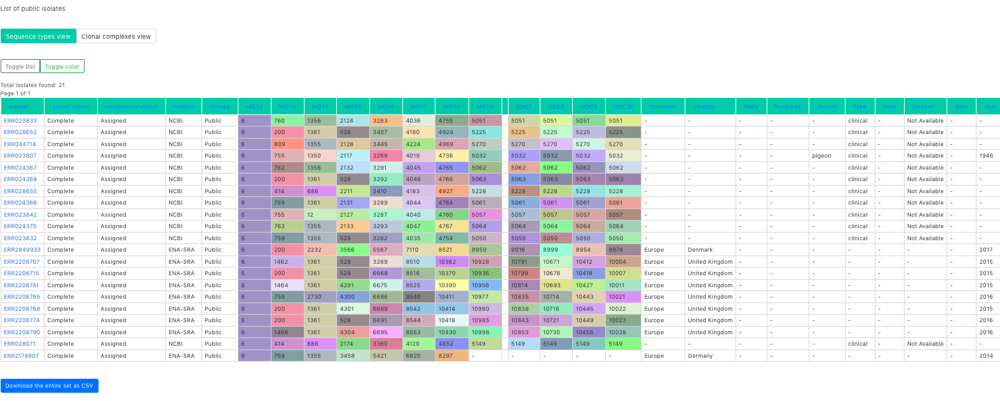

.. _website:

***********************************
MGTdb website features
***********************************

MGTdb is a webservice and database system which enables a user to upload isolates, obtain MGT assignments and explore these in the context of the local and global database of isolates. MGTdb is currently available for three organisms namely, *Salmonella* Typhimurium (Payne *et al.* 2020) at https://mgtdb.unsw.edu.au/salmonella, *Salmonella* Enteritidis (Luo *et al.* 2021) at https://mgtdb.unsw.edu.au/enteritidis and *Vibrio cholerae* (Cheney *et al.* 2021) at https://mgtdb.unsw.edu.au/vibrio. 

The MGT website is available at: https://mgtdb.unsw.edu.au

Navigating the website
======================

The various features of the website are shown below.

Summary of global epidemeology
--------------------------------

In a species homepage, top 5 ST (Sequence Type) distribution by the continents can be seen. Hovering reveals the ST number as well as the number of isolates with this ST. In the figure below, the top ST value and count is shown for South America (ST=23, count=27).

.. image:: images/globalEpi.png
  :width: 2000
  :alt: in this fig.

Search
------

As you navigate the website, at various points you can come across filtering isolates.

.. image:: images/filterIsolates.png
  :width: 600
  :alt: in this fig.

The isolate filter feature. Isolates can be searched for by metadata, name, MGT-ST assignment and MGT-CC assignment. Isolates can be searched for by multiples of these as well. On searching the results are displayed in a table, as shown in the image below.

These isolates can also be downloaded via the button shown at the bottom of the table. Currently, there is a maximum limit of 10,000 for the download.

On selecting an isolate, its details, can be displayed, as shown below.

Features of this isolate can be selected by clicking on them (here selected are isolate type: "clinical" and Sequence type: "6"). An exact mach is then performed, and resultant strains are shown in a table (similar to the previous figure).

Account features
================

You can create an account with MGT which enables you to submit isolates, and get an MGT assignment for them.

Creating an account
-------------------

You can set up an account at the website. Simply click on Register at the top navigation bar, and enter in your details.

Doing so will send you an email with a link (check your junk email if you don't receive an email within a few minutes). Click or copy and paste the link, and your account will be active, and you can log in with your supplied details.

Note: Certificates will be added soon to make your communication with the website httpsecure.

Uploading isolates
------------------

Once you log in, you can add projects, and isolates to a project.

Creating a project is straightforward. Simply click on 'Projects' in the top navigation bar. Then select the organism you want to create a project for.

Clicking on '+ Add new project' to create a new project. Only a project name is required to create a project.

Once a project is created, navigate to the project detail. Then clicking on '+ Upload new isolate' enables you to add isolates.

.. image:: images/createIsolate.png
  :width: 400
  :alt: in this fig.

Webpage to enable adding isolate to the MGT database. The relevant information can be supplied here.

Note, that for the files to be uploaded, either Illumina sequenced files forward and reverse should be supplied, or alleles files. The advance of providing alleles file is that the uploaded file is a lot smaller (if internet speeds are an issue).

To generate the allele files locally see section  :ref:`local_allele_calling`. Apart from the uploaded files, Collection year, Country, Countinent, Privacy status and Isolate name are compulsory fields.

Once information is received on the server, it is submitted as a job, where the alleles are first extracted (if reads are provided), following which an MGT assignment is made and added to the database. Details about this process can be found on :ref:`analysis_pipeline`.

Once an MGT assignment is made, an email notification is sent.

Privacy
-------

We take your uploaded isolates privacy very seriously. Your isolates are made public only if you specify. Furthermore, if you delete your isolates, then all associated isolate meta-data and the uploaded files are deleted.

Note that when a project is deleted, all the isolates in that project and their associated data are deleted.

References 
----------

Cheney L, Payne M, Kaur S, Lan R. Multilevel Genome Typing Describes Short-and Long-Term Vibrio cholerae Molecular Epidemiology. *Msystems*. 2021 Aug 24;6(4):e00134-21.

Luo L, Payne M, Kaur S, Hu D, Cheney L, Octavia S, Wang Q, Tanaka MM, Sintchenko V, Lan R. Elucidation of global and national genomic epidemiology of Salmonella enterica serovar Enteritidis through multilevel genome typing. *Microbial genomics*. 2021 Jul 22;7(7):000605.

Payne M, Kaur S, Wang Q, Hennessy D, Luo L, Octavia S, Tanaka MM, Sintchenko V, Lan R. Multilevel genome typing: genomics-guided scalable resolution typing of microbial pathogens. *Eurosurveillance*. 2020 May 21;25(20):1900519.